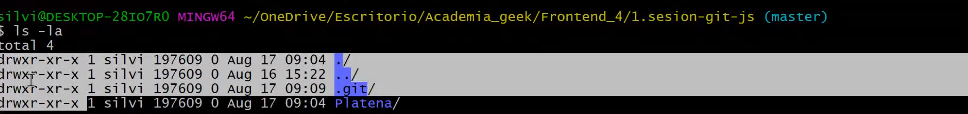

# Reviuw 
---
### ¿what is git?

It is a necessary version controller in the work life of a programmer since each user has a copy of the project so they can easily work without damaging the main page.

### Requerid Commands 
- Config
1. git --version
2. git help
3. git config --global user.(email || user) "email || user"
4. git config --global -e
5. git config --global -l
6. ls -la
7. mkdir (&&) rm -rf

- Bonding
1. git clone <url>
2. git init
3. git remote add <repositorio-remote> <url>
4. git remote -v
5. touch && nano

- Branch
1. git branch  <name-branch>
2. git branch
3. git branch
4. git branch

- Checkout
1. git Checkout 
2. git Checkout -b <name-branch>

- Status
1. git add <archivo>
2. git add -A
3. git add .
4. git add -all
5. git status -s -b ??

